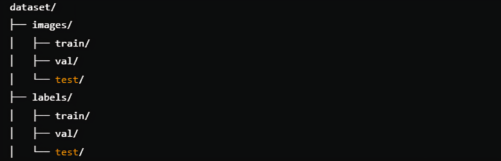

# **YOLOv5n Training on Custom Dataset**

This repository contains a Colab notebook to train a YOLOv5n model on a custom dataset. YOLOv5n is a lightweight variant of the YOLOv5 object detection model, ideal for edge devices and scenarios where efficiency and speed are critical.

---

## **Features**
- Train the YOLOv5n model on your own dataset.
- Use transfer learning by leveraging pre-trained weights.
- Support for custom object classes and annotations.
- Lightweight and optimized model for real-time object detection.
- Integration with popular annotation tools like [LabelImg](https://github.com/heartexlabs/labelImg) or [Roboflow](https://roboflow.com/).

---

## **Table of Contents**
- [Prerequisites](#prerequisites)
- [Dataset Preparation](#dataset-preparation)
- [Colab Workflow](#colab-workflow)
- [Training Process](#training-process)
- [Results and Evaluation](#results-and-evaluation)
- [Next Steps](#next-steps)
- [Acknowledgments](#acknowledgments)

---

## **Prerequisites**
Before you begin, ensure you have the following:
1. **Google Colab Account**: You can run the training process for free on Colab.
2. **Python 3.8+**: Used for running YOLOv5 scripts and dependencies.
3. **Dataset**: Your dataset should be annotated in YOLO format. Use tools like:
   - [LabelImg](https://github.com/heartexlabs/labelImg) for manual annotation.
   - [Roboflow](https://roboflow.com/) for annotation and dataset preprocessing.
4. **Git**: To clone the YOLOv5 repository.

---

## **Dataset Preparation**
To train your model:
1. **Annotate Images**: Use [LabelImg](https://github.com/heartexlabs/labelImg) or [Roboflow](https://roboflow.com/) to annotate your dataset.
2. **Format Dataset**: Ensure your dataset follows the structure below:




Each `.txt` file in the `labels` folder should contain the bounding box annotations in YOLO format:

      <class_id> <x_center> <y_center> <width> <height>

3. **Upload Dataset**: Use Google Drive or any preferred storage platform to store your dataset. Make sure to mount the storage in Colab.

---

## **Colab Workflow**
Follow the steps below to train YOLOv5n using the Colab notebook provided:
1. Clone the YOLOv5 repository:
```bash
!git clone https://github.com/ultralytics/yolov5.git
```
2. Install dependencies:
```
%pip install -r yolov5/requirements.txt
```
3. Configure dataset paths in the .yaml file (e.g., data.yaml):
```
train: /path/to/train/images
val: /path/to/val/images
nc: <number_of_classes>
names: [<class_1>, <class_2>, ...]
```
4. Run the training script:
```
!python train.py --img 640 --batch 16 --epochs 100 --data data.yaml --weights yolov5n.pt
```

# Training Process
Pre-Trained Weights:
The training process uses ```yolov5n.pt``` as the base weights.

### Hyperparameters:
Customize key hyperparameters like batch size, epochs, and learning rate to optimize your training.

### Output Files:
The ``` runs/train/exp ``` directory will contain:
```best.pt```: The best-performing weights.

results.png:
A graphical summary of training metrics.

confusion_matrix.png:
A detailed performance visualization.

### Results and Evaluation
Once training is complete:

Test your model:
```
!python detect.py --weights runs/train/exp/best.pt --img 640 --source <test_image_or_video>
```
##### Evaluate performance metrics like precision, recall, and mAP.
---
### After obtaining the best.pt file, consider:

### Testing the Model:

Use the model on unseen data to evaluate real-world performance.

---

### Fine-Tuning:
Improve performance by adjusting hyperparameters or adding more data.

---

### Deployment:
Deploy the model on edge devices or integrate it into applications using ONNX, TensorRT, or Flask/Django web apps.
Acknowledgements

---

### This project leverages:

Ultralytics YOLOv5 Repository for the base model and training scripts.
Tools like LabelImg and Roboflow for dataset annotation and preparation.

---


Feel free to fork, clone, and improve this repository for your own custom YOLOv5n training projects! 🚀


---

                                               Created By Akhiljith ❤️

